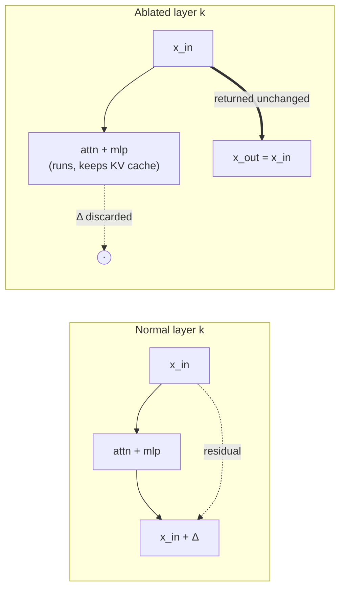
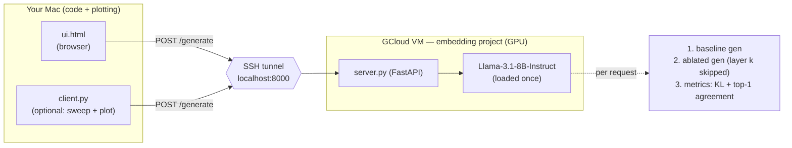

# Removing a "meaning-forming" layer from Llama-3.1-8B

Interactive experiment: **remove one decoder layer** from Llama-3.1-8B-Instruct
and watch what happens to generation.

Layer-wise t-SNE of the hidden states shows three regimes:

| Layers (plot label) | What you see | Interpretation |
|---|---|---|
| **L0–L5** | clean, well-separated category clusters | surface / token-level features |
| **L6–L17** | clusters blur and mix together | **concept / meaning-forming** layers |
| **L18–L32** | clusters re-separate cleanly | task / output-oriented representations |

We ablate a middle (meaning-forming) layer and compare **baseline vs ablated**
generation for our own prompts, with quantitative metrics.

## What "removing a layer" means

Every decoder layer is residual: `x_out = x_in + attn(x_in) + mlp(x_in)`.
We wrap the target layer so it still runs (keeping the KV cache consistent) but
returns its **input** unchanged — so the residual stream skips it. Reversible.



> **Indexing:** the t-SNE grid is `output_hidden_states` — `L0` = embeddings,
> so **plot `Lk` = decoder layer index `k-1`**. The API/UI use the 0-based
> decoder index (0–31); e.g. `decoder[14]` = plot **L15**.

## Architecture

The 8B model runs on the GPU VM. Your Mac only runs a browser UI (and an optional
plotting client), reaching the VM through an SSH port-forward.



## Run it

### 1. On the VM (env already provisioned)

```bash
python server.py                 # bf16 on CUDA, binds 127.0.0.1:8000
# python server.py --load-4bit   # for a small GPU
# python server.py --self-test   # verify ablation logic without loading the model
```

Needs `HF_TOKEN` in `.env` (already present). Fresh VM? `pip install -r requirements-vm.txt`.

### 2. Open the tunnel (from the Mac)

```bash
gcloud compute ssh <vm-name> --project <embedding-project> -- -N -L 8000:localhost:8000
```

### 3. Use it (on the Mac)

**UI (primary):** open `ui.html` in your browser. Type a prompt, pick the layer to
remove (default `decoder[14]` = L15), hit **Generate & compare**. You get baseline
vs ablated side-by-side plus:

- **KL divergence** — how far the ablated next-token distribution moved from baseline.
- **Top-1 agreement %** — fraction of positions where the top predicted token is unchanged.

High KL / low agreement ⇒ that layer mattered. (Middle layers are often surprisingly
robust — removing one degrades gently; removing an early or late layer breaks it.)

**CLI + plotting (optional):**

```bash
uv sync                                              # set up the Mac env
uv run client.py "Explain why the sky is blue." --layer 14
uv run client.py "Write a haiku about autumn." --sweep 4 18   # → results/sweep.png
```

## Files

| File | Where | Purpose |
|---|---|---|
| `server.py` | VM | FastAPI inference + layer ablation + metrics |
| `ui.html` | Mac | interactive side-by-side UI (no build, no deps) |
| `client.py` | Mac | optional CLI + layer-sweep plot |
| `pyproject.toml` | Mac | `uv`-managed env for `client.py` |
| `requirements-vm.txt` | VM | reference deps (already installed) |
| `docs/superpowers/specs/` | — | design spec |
