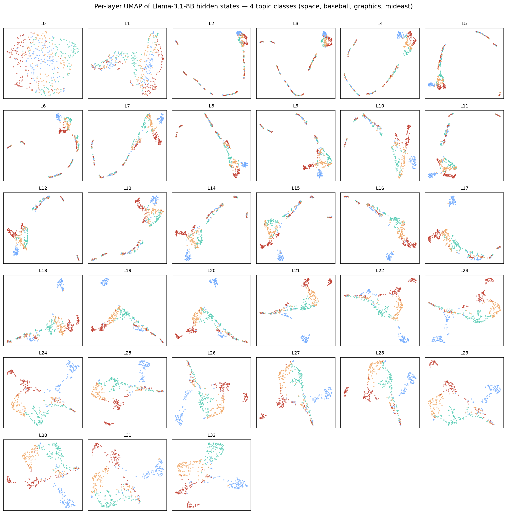
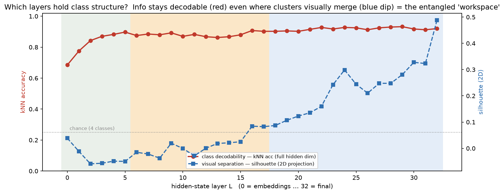
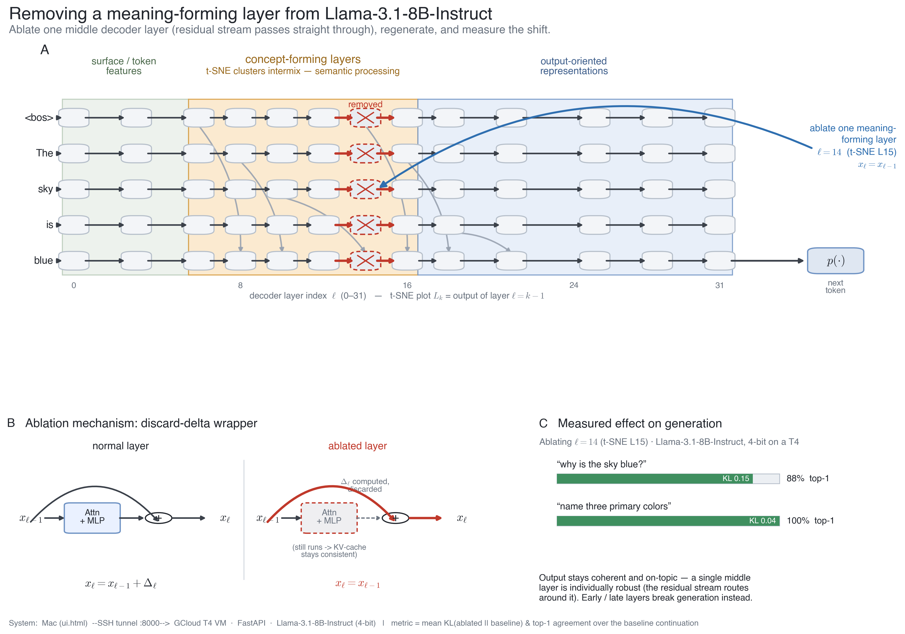
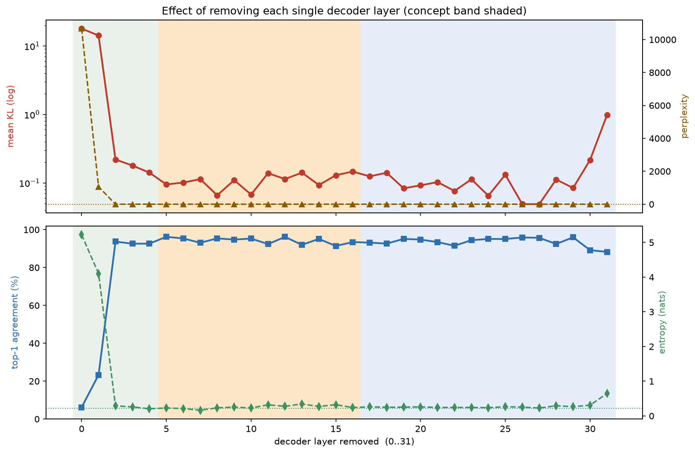
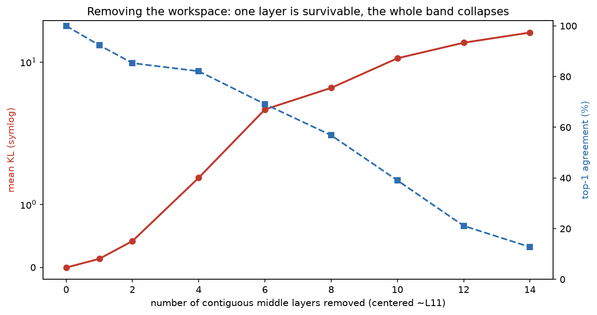
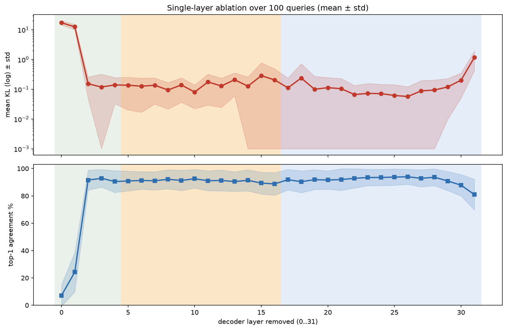
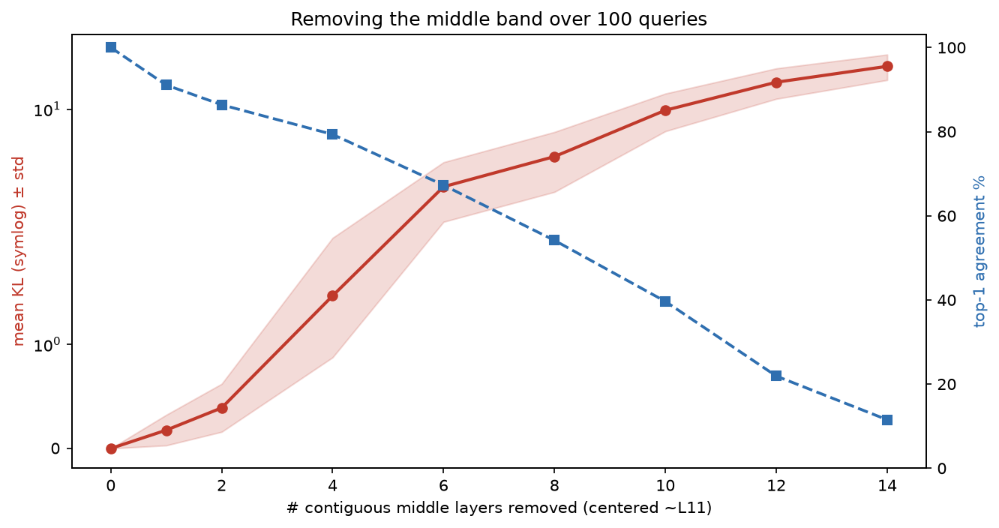
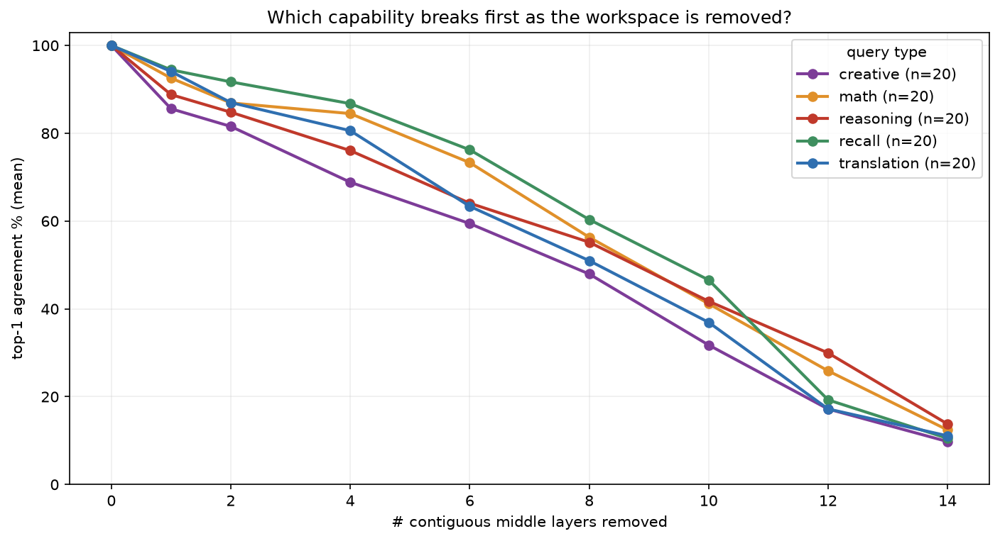
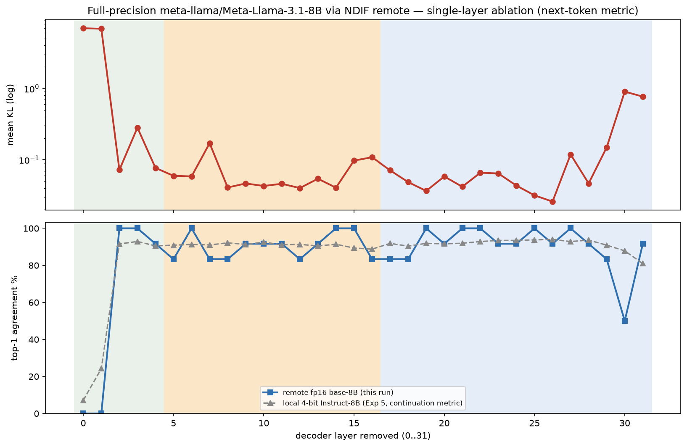
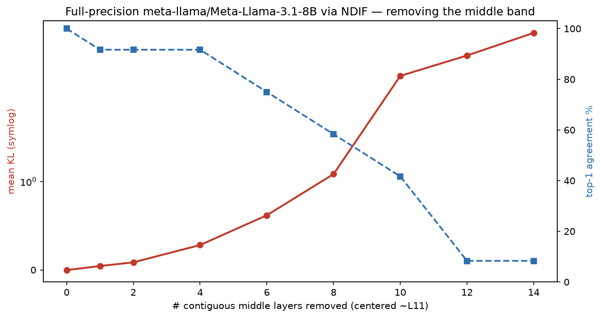

# Where does a language model *think*? Finding and removing the "workspace" layers of Llama-3.1-8B

*A hands-on interpretability walkthrough: we watch concepts form layer-by-layer inside
Llama-3.1-8B-Instruct, quantify which layers carry meaning, then delete layers — one at a
time and in groups — and measure exactly how generation degrades. Then we connect it to
Anthropic's 2026 "global workspace" result. Everything runs on a single T4 GPU.*

> **TL;DR.** Topic information becomes **decodable within the first few layers and stays
> decodable everywhere** (kNN ≈ 0.9 from layer 2 on). But through the first ~half of the
> network the classes are **visually entangled** — they collapse onto overlapping manifolds
> (silhouette ≈ 0) — and only **re-separate into clean clusters in the second half**. That
> entangled-but-decodable middle is where meaning is *worked on*. Deleting **one** middle
> layer barely dents generation; deleting the **whole band** collapses reasoning while
> leaving shallow recall intact — the same asymmetry Anthropic report when they ablate the
> **J-space / global workspace** [10]. Across **100 queries** (§6b), removing the band breaks
> **creative/abstract generation first and single-step recall last**.

---

## 0. Setup

- **Model:** `meta-llama/Llama-3.1-8B-Instruct` — 32 residual decoder layers, hidden 4096.
- **Compute:** one NVIDIA T4 (16 GB), model in 4-bit (nf4).
- **Two hooks:** `output_hidden_states=True` gives **33** residual-stream tensors
  (`L0` = embeddings; **`Lk` = output of decoder layer `k-1`** — mind this off-by-one), and a
  **layer-ablation wrapper** that turns any decoder block into an identity so the residual
  stream skips it (§4).
- **Data:** 400 texts, 4 balanced topic classes from 20-Newsgroups
  (*space, baseball, graphics, mideast*), mean-pooled per layer.

Reproduce from this repo — see §8.

---

## 1. First: KL divergence is **not** entropy

The question that started this. They're related but distinct:

| Quantity | Formula | Measures | # distributions |
|---|---|---|---|
| **Entropy** `H(p)` | `−Σ p·log p` | uncertainty of *one* distribution | 1 |
| **Cross-entropy** `H(p,q)` | `−Σ p·log q` → `perplexity = exp(H)` | coding `p` with `q` | 2 |
| **KL divergence** `Dₖₗ(p‖q)` | `Σ p·log(p/q) = H(p,q) − H(p)` | how far `p` is from reference `q` | 2 |

- **Entropy** is about *one* distribution — how spread/uncertain it is.
- **KL divergence** ("relative entropy") is about *two* — how far the ablated model's
  next-token distribution `p_ablated` moved from the original `p_baseline`. It is `≥ 0`, `= 0`
  iff identical, and **not symmetric**.

So "measure the KL divergence of removing a layer" = compute `Dₖₗ(p_ablated ‖ p_baseline)` at
each position — *how much did deleting this layer change the predictions?* We also report the
**entropy** `H(p_ablated)` separately, because a broken model can move two ways: become
**uncertain** (entropy ↑, distribution flattens) or get **stuck** (entropy ↓, repeats). KL
catches both; entropy tells you which.

---

## 2. Experiment 1 — watch the representation reorganise, layer by layer

Push the 4-class set through the model, mean-pool the hidden state at each layer, project each
layer to 2D with UMAP [8], colour by class:



- **Embeddings / early (≈ L0–L5).** `L0` is a diffuse cloud; by `L2–L6` the points collapse
  onto thin, folded **1-D manifolds** with the four topics **interleaved** along the curve.
- **Middle (≈ L6–L16).** Still entangled — clusters overlap heavily; one class (graphics,
  blue) starts to peel off around `L11–L14`.
- **Late (≈ L18–L32).** Clean **4-way separation** emerges and sharpens all the way to the
  final layer.

The representation goes **entangle → re-specialise**, echoing the logit lens [1], the tuned
lens [2], and Tenney et al.'s "BERT rediscovers the classical NLP pipeline" [4].

> **Careful:** UMAP/t-SNE are nonlinear 2-D projections [8]. "Looks entangled" is a statement
> about the *projection*, not about whether the class is *present*. Which is what §3 checks —
> and the answer flips the naive reading.

---

## 3. Experiment 1b — decodable vs. visually separated (this gap *is* the workspace)

For every layer, two measurements on the same embeddings:
**kNN accuracy on the full 4096-d state** (can a classifier still read the class? = *decodability*)
and **silhouette on the 2-D projection** (how visually separated? = *apparent* separation).



- **Decodability (red) is high everywhere:** `0.68` at embeddings → `~0.90` by layer 5, and it
  stays `0.86–0.93` for the entire rest of the network. The class is *always* linearly-ish
  readable from layer 2 onward.
- **Visual separation (blue) tells the opposite story early:** silhouette is **≈ 0 (even
  negative)** through roughly `L1–L15`, then climbs steeply to **`0.49`** by the final layer.

The **gap** — high decodability, near-zero visual separation — is the signature of a
**distributed, entangled** code: the information didn't leave, it went into overlapping
directions (**superposition** [5]). This is exactly the regime Anthropic's workspace lives in:
their J-space is only **~6–10% of activation variance** yet carries the concepts the model
reasons over [10].

---

## 4. Experiment 2 — turning a layer off

Every decoder block is residual: `x_out = x_in + attn(x_in) + mlp(x_in)`. To *remove* layer
`ℓ` we wrap it so it still runs (keeping the KV-cache consistent) but returns its **input**
unchanged, so the residual stream skips it: `x_out = x_in`. Reversible, no retraining — the
layer-level analogue of activation patching / causal tracing [3].



---

## 5. Experiment 3 — remove each layer, one at a time

For 8 prompts we generate a greedy baseline continuation, then — teacher-forced on it —
re-run with one layer ablated and measure KL, top-1 agreement, entropy, perplexity:



Not a symmetric U — it's an **early cliff**:

- **Layers 0–1 are load-bearing.** Remove `L0` → `KL ≈ 18`, top-1 `6%`, perplexity `~10,700`.
  Remove `L1` → `KL ≈ 14`, top-1 `23%`. The model is destroyed.
- **Every other single layer is remarkably survivable.** `L2–L29`: `KL ≈ 0.05–0.22`, top-1
  `89–96%`, perplexity barely above the `1.10` baseline. Middle layers are individually the
  *most redundant* — which is exactly why depth-pruning methods delete them [6, 7].
- **The final layer matters a bit more:** `L31` → `KL ≈ 0.98`, top-1 `88%`.

One missing middle block? The residual stream just routes around it.

---

## 6. Experiment 4 — remove the **whole band** → the workspace collapses

Individually redundant ≠ collectively expendable. Delete a **growing contiguous window** of
middle layers (centred ~`L11`) and watch the model fall over:



| layers removed | KL | top-1 | perplexity |
|---:|---:|---:|---:|
| 1 | 0.14 | 92% | 1.2 |
| 2 | 0.42 | 85% | 1.4 |
| 4 | 1.4 | 82% | 1.7 |
| 6 | 3.8 | 69% | 2.8 |
| 8 | 5.9 | 57% | 7.0 |
| 10 | 10.8 | 39% | 33 |
| 12 | **14.8** | **21%** | **183** |
| 14 | 18.2 | 13% | 2658 |

A graceful-then-catastrophic collapse. (An independent interactive run agrees: removing the
whole 12-layer concept band on *"why is the sky blue?"* gave `KL ≈ 15.6`, top-1 `20%`, and the
output degenerated into *"…the sky is a beautiful blue and the sky is a beautiful blue. It's a
blue collar, a blue collar…"* — the **word** "blue" survived, the **explanation** did not.)

---

## 6b. Experiment 5 — scaling to 100 queries, and *which* capability breaks first

Experiments 3–4 used 8 prompts. Here we repeat both on **100 queries**, balanced across
five capability types (20 each: **recall, reasoning, math, translation, creative**), and add
the question the workspace paper really cares about: *when you remove the band, does
**reasoning** break before **recall**?* (Raw per-query numbers: [`per_query_results.csv`](figures/per_query_results.csv)
/ [`.json`](figures/per_query_results.json); aggregates in [`metrics_100.json`](figures/metrics_100.json).)

**Single-layer sweep, now with variance bands** — the early cliff is rock-solid:



`L0` → KL 17.2 / top-1 7%; `L1` → KL 12.6 / top-1 24%; **every layer `L2–L29` sits at top-1
89–94%** (KL ≈ 0.1); only the final layer creeps up (`L31`: KL 1.18 / top-1 81%). Across 100
queries, exactly two layers are individually load-bearing.

**Cumulative band removal** — the same graceful-then-catastrophic collapse, averaged over 100:



| layers removed | 1 | 2 | 4 | 6 | 8 | 10 | 12 | 14 |
|---|---|---|---|---|---|---|---|---|
| KL | 0.18 | 0.39 | 1.5 | 3.9 | 5.6 | 9.9 | 13.9 | 16.9 |
| top-1 | 91% | 86% | 79% | 67% | 54% | 40% | 22% | 12% |

**Which capability breaks first?** Splitting the band-removal effect by query type:



Through the informative mid-range (4–10 layers removed) the ordering is consistent:

| layers removed | recall | math | reasoning | translation | creative |
|---|---|---|---|---|---|
| 4 | **87%** | 84% | 76% | 81% | 69% |
| 6 | **76%** | 73% | 64% | 63% | 59% |
| 8 | **60%** | 56% | 55% | 51% | 48% |

**Single-step recall is the most robust; open-ended / creative generation collapses first**,
with reasoning and translation in between. That's the direction Anthropic's workspace result
predicts — abstract, generative capability leans hardest on the middle band, shallow recall
leans on it least. Two honest caveats: the separation is **graded, not on/off**, and beyond
~12 layers removed *everything* converges toward collapse (the ordering gets noisy when the
model is already broken). The metric is top-1 agreement with the intact model's own greedy
continuation — a proxy for "output preserved," not a correctness grade.

---

## 6c. Experiment 6 — full-precision replication via nnsight + NDIF (no local GPU)

Everything above ran **4-bit** on a T4, on the **Instruct** model, with a continuation
metric. Are the findings artifacts of any of those? We re-ran the ablation on
**full-precision `Meta-Llama-3.1-8B` (base)** using [nnsight](https://nnsight.net) with
`remote=True`, so the model executes on **NDIF's servers** — the laptop only orchestrates
(no local GPU, no VM). Ablation here is a one-liner: a layer's input *is* the previous
layer's output, so `layers[L].output = layers[L-1].output` makes it identity.



The **early cliff reproduces exactly**: removing `L0`/`L1` → top-1 **0%**; every layer
`L2–L29` → top-1 83–100% (KL ≈ 0.03–0.28); a bump at the last layers. Overlaid on our local
4-bit Instruct curve (grey), the two track closely despite different **precision** (4-bit vs
fp16), **variant** (Instruct vs base), **backend** (local T4 vs NDIF), and **metric**
(continuation vs next-token). And the band collapse repeats:



So the "two load-bearing early layers + robust-but-collectively-essential middle" picture is
**not** a quantization or instruction-tuning artifact — it's a property of the architecture.

*Practical notes for anyone reproducing:* nnsight 0.7 needs `transformers>=4.48,<5`; remote
interventions must **rebind** the output (`layer.output = ...`) rather than write in-place
(`[:]=`, which isn't captured); and the free NDIF tier only runs **pinned** models (the base
8B/70B/405B), not arbitrary checkpoints — hence base, not Instruct.

---

## 7. The connection: a blunt version of the "global workspace"

Anthropic's **"Verbalizable Representations Form a Global Workspace in Language Models"**
(Gurnee, Sofroniew, … Lindsey; Anthropic, July 2026) [10] identifies a **J-space** — a small
set of token-aligned directions in intermediate layers (~6–10% of variance) that behaves like
a cognitive-science *global workspace* [9]: a shared blackboard the model reads concepts from
and reasons over. When they **suppress the top J-space directions**:

| Impaired | Preserved |
|---|---|
| multi-hop **reasoning** (→ ~0%) | text parsing, grammatical **fluency** |
| **creative / abstract** generation | shallow classification, fact extraction |
| experiential self-report | **single-step factual recall** |

Our coarse experiment — deleting whole *layers* rather than surgical *directions* — reproduces
the **same asymmetry**: kill the middle band and reasoning/abstraction dies while shallow
recall survives. And §3 shows *why* that band is special: it's where topic is maximally
**entangled yet fully decodable** — an information-rich, low-variance workspace, not a
bottleneck.

**Honest caveats.**
- We remove **entire layers** (sledgehammer); the J-space is a **low-rank subspace within**
  layers (scalpel). Layer ablation is a coarse, correlational proxy for workspace ablation.
- Regime boundaries are eyeballed; §3's decodability-vs-silhouette gap is the real evidence.
- One model, 4-bit, teacher-forced KL over short greedy continuations, 400 texts / 8 prompts.
  Directional, not a benchmark. (Mean-pooling + UMAP also shape the *early*-layer picture; the
  invariant, method-robust claim is the decodable-but-entangled middle.)

Still — a satisfying result on a single T4: the layers where classes *stop looking separated*
are precisely the layers you *can't* remove as a group without losing the ability to reason.
That's where the workspace lives.

---

## 8. Reproduce

```bash
# On the GPU box (VM):
python server.py --load-4bit                 # FastAPI on :8000
python experiments/run_experiments.py        # UMAP grid, separability, ablation (8-prompt)
python experiments/run_queries100.py         # 100-query sweep + per-category + CSV/JSON

# Full-precision replication on NDIF (no local GPU) — needs NDIF_API_KEY in .env:
python experiments/nnsight_remote_sweep.py    # remote_sweep.png, remote_cumulative.png

# From your laptop: tunnel + open ui.html, ablate any set of layers interactively
gcloud compute ssh <vm> -- -N -L 8000:localhost:8000
#   ui.html → 0–31 toggle grid (presets: Concept L6–L17, Early, Late) → Generate & compare

python client.py "Explain why the sky is blue." --sweep 0 31   # CLI layer sweep → plot
```

## 9. References

1. nostalgebraist (2020). *Interpreting GPT: the Logit Lens.* LessWrong.
2. Belrose et al. (2023). *Eliciting Latent Predictions from Transformers with the Tuned Lens.* arXiv:2303.08112.
3. Meng, Bau, Andonian, Belinkov (2022). *Locating and Editing Factual Associations in GPT* (ROME / causal tracing). NeurIPS. arXiv:2202.05262.
4. Tenney, Das, Pavlick (2019). *BERT Rediscovers the Classical NLP Pipeline.* ACL. arXiv:1905.05950.
5. Elhage et al. (2022). *Toy Models of Superposition.* Anthropic / Transformer Circuits.
6. Gromov, Tirumala, Shapourian, Glorioso, Roberts (2024). *The Unreasonable Ineffectiveness of the Deeper Layers.* arXiv:2403.17887.
7. Men et al. (2024). *ShortGPT: Layers in Large Language Models are More Redundant Than You Expect.* arXiv:2403.03853.
8. McInnes, Healy, Melville (2018). *UMAP.* arXiv:1802.03426. / van der Maaten & Hinton (2008). *t-SNE.* JMLR.
9. Baars (1988); Dehaene et al. — *Global Workspace Theory* of consciousness (the analogy).
10. Gurnee, Sofroniew, Pearce, … Lindsey (2026). **Verbalizable Representations Form a Global Workspace in Language Models.** Anthropic. https://transformer-circuits.pub/2026/workspace/index.html
11. Fiotto-Kaufman et al. (2024). *NNsight and NDIF: Democratizing Access to Foundation Model Internals.* arXiv:2407.14561. https://nnsight.net

---

*Built on a GCloud T4 VM · Llama-3.1-8B-Instruct (4-bit) · figures from
`experiments/run_experiments.py` and `figures/make_figure.py` · numbers in
`blog/figures/metrics.json`.*
