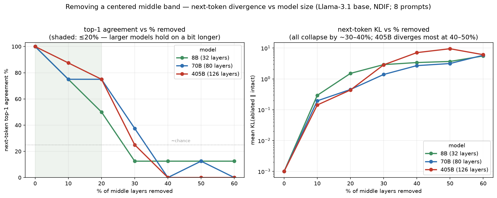

# Removing Layers to Find the Workspace: A Layer-Ablation Study of Llama-3.1 (8B / 70B / 405B)

*A self-contained research report. We locate where meaning forms across the depth of
Llama-3.1, delete layers — singly and in bands — and measure the effect on the next-token
distribution and on free generation, across three model sizes and two compute backends
(a local T4 GPU and NDIF remote via `nnsight`). We connect the results to Anthropic's 2026
"global workspace" (J-space) finding.*

**Author:** Sumit Yadav · **Model family:** `meta-llama/Llama-3.1` · **Tools:** PyTorch,
Transformers, `nnsight`/NDIF · **Compute:** 1× NVIDIA T4 (4-bit) + NDIF remote (fp16, up to 405B).

---

## Abstract

Transformer language models refine a *residual stream* layer by layer. We ask three questions:
(1) *Where* along the depth does class/semantic structure become available? (2) *Which* layers
are causally necessary — what happens if we remove them? (3) Does the answer change with model
*scale*? Using a layer-wise projection of hidden states we show that topic information is
linearly **decodable from layer 2 onward yet visually entangled** through the first half of the
network, re-separating only near the output. Ablating a **single** middle layer is nearly
harmless (an "early cliff": only the first two layers are individually critical), but removing a
**contiguous middle band** degrades the model monotonically. Splitting by task type, **abstract
/ creative generation degrades first and single-step recall last** — the qualitative signature
Anthropic report for their J-space "global workspace." Replicating on full-precision 8B, 70B and
405B via NDIF shows the pattern is not a quantization or instruction-tuning artifact, and that
**larger models tolerate more middle-band removal** before their next-token distribution
collapses — while *free-generation fluency* is far more robust than the distributional metrics
imply.

---

## 1. Objective

1. **Localise representation formation.** Determine, per layer, where a 4-way topic label is
   (a) *decodable* and (b) *visually separable*, and interpret the gap between the two.
2. **Measure causal necessity by ablation.** Quantify the effect of making one layer — or a
   band of contiguous layers — an identity function, on (i) the next-token distribution
   (KL divergence, top-1 agreement, entropy, perplexity) and (ii) free generation (readable text).
3. **Test capability-specificity.** Ask whether removing the middle band harms *reasoning*
   differently from *recall*, *math*, *translation*, and *creative* generation.
4. **Test scale-dependence.** Repeat the ablation on 8B, 70B and 405B and characterise how
   tolerance to removal grows with model size.
5. **Relate to the "global workspace" hypothesis** (Anthropic 2026) and to the layer-pruning
   literature.

---

## 2. Background and Literature Review

**The residual stream.** A decoder block ℓ reads the running hidden state and writes an additive
update: `x_ℓ = x_{ℓ-1} + Attn(x_{ℓ-1}) + MLP(x_{ℓ-1})`. Because the update is additive, each
block can be *removed* by replacing its output with its input (`x_ℓ = x_{ℓ-1}`) — the stream
simply skips it. This "residual stream as a communication bus" view underlies most of modern
interpretability (Elhage et al., *A Mathematical Framework for Transformer Circuits*, 2021).

**Reading intermediate states.** The **logit lens** (nostalgebraist, 2020) decodes an
intermediate residual through the output unembedding to see the model's "current guess"; the
**tuned lens** (Belrose et al., 2023) learns per-layer probes to do this faithfully. Tenney,
Das & Pavlick (2019) showed BERT "rediscovers the classical NLP pipeline" across depth —
lower layers do surface/syntax, higher layers do semantics — motivating the idea that different
depths carry different kinds of information.

**Superposition and features.** Elhage et al. (*Toy Models of Superposition*, 2022) argue
features are packed into overlapping directions, so information can be present (decodable) even
when a 2-D projection looks entangled. This directly predicts the decodability-vs-separation gap
we observe in §5.1.

**Causal methods.** ROME (Meng et al., 2022) uses **activation patching / causal tracing** —
corrupt an input, restore a clean activation at a specific (layer, position), and see whether
the output recovers — to localise where a fact "lives." Ablation (setting a component to
identity / zero / mean) is the complementary "necessity" test.

**Layer redundancy / pruning.** Gromov et al. (*The Unreasonable Ineffectiveness of the Deeper
Layers*, 2024) and Men et al. (*ShortGPT*, 2024) show many transformer layers — especially
deeper/middle ones — can be pruned with little loss, and that larger models are more redundant.
Our single-layer and scale results are consistent with this.

**The global workspace.** Anthropic's 2026 report *Verbalizable Representations Form a Global
Workspace in Language Models* (Gurnee, Sofroniew, … Lindsey) identifies a **J-space** — a small
(~6–10% of variance) set of token-aligned directions in intermediate layers, discovered with a
**Jacobian lens** — that behaves like a cognitive-science *global workspace* (Baars 1988;
Dehaene): a shared blackboard the model reads concepts from and reasons over. Suppressing the
top J-space directions **impairs multi-hop reasoning and abstract generation while preserving
parsing, fluency, and single-step recall.** This report is a coarse, layer-level analogue of
that surgical, direction-level experiment; the repository name (`…-remove-jspace-layer`) reflects
the connection.

---

## 3. Methodology and Mathematics

### 3.1 Layer indexing

With `output_hidden_states=True` a model with L decoder layers returns L+1 tensors: index 0 is
the token-embedding output, and index k (1..L) is the output of decoder layer k−1. We write
**Lk** for the k-th hidden-state tensor (plot label) and use the **0-based decoder index ℓ ∈
[0, L−1]** for ablation. Thus plot **L15 = output of decoder layer ℓ=14**. (This off-by-one is a
common source of error.)

### 3.2 The ablation operator (Figure 1)

To remove decoder layer ℓ we make it the identity map on the residual stream. Two equivalent
implementations were used:

- **Discard-delta wrapper (local, PyTorch).** Wrap the block so it still *runs* (keeping the
  attention KV-cache consistent during generation) but returns its **input** unchanged:
  `output_hidden_states := input_hidden_states`, i.e. `x_ℓ = x_{ℓ-1}`. Fully reversible.
- **Rebind (remote, nnsight).** Since layer ℓ's input equals layer ℓ−1's output, set
  `layers[ℓ].output = layers[ℓ−1].output` (embeddings for ℓ=0). Identical net effect.

To remove a **band** `{ℓ_start … ℓ_end}` we set every block in the band to pass the pre-band
value through, so the whole band collapses to identity.

### 3.3 Distributional metrics

Let `p` and `q` be next-token probability distributions over the vocabulary V.

- **Entropy** (uncertainty of one distribution): `H(p) = − Σ_{x∈V} p(x) log p(x)`.
- **Cross-entropy**: `H(p, q) = − Σ_x p(x) log q(x)`; the model's **perplexity** on data is
  `PPL = exp(H)`.
- **KL divergence** ("relative entropy," how far p is from reference q):
  `D_KL(p ‖ q) = Σ_x p(x) log( p(x) / q(x) ) = H(p, q) − H(p)`. It is ≥ 0, zero iff p = q, and
  **not symmetric**. *KL is not entropy* — entropy is about one distribution, KL about two.

We compare an **ablated** model to the **intact baseline**, teacher-forced on the baseline's own
greedy continuation (same context, so differences are purely the ablation's effect):

- **Mean KL** `= mean_t D_KL( p^{abl}_t ‖ p^{base}_t )` over continuation positions t — how much
  the predictions moved.
- **Top-1 agreement** `= mean_t 1[ argmax p^{abl}_t = argmax p^{base}_t ]` — fraction of
  positions whose most-likely token is unchanged.
- **Entropy** `H(p^{abl})` — whether the broken model becomes *uncertain* (entropy ↑) or *stuck*
  (entropy ↓, repetition). KL catches both; entropy says which.

### 3.4 Representation-geometry metrics

For a labelled set (4 topic classes), per layer we compute:

- **Decodability** — 5-fold cross-validated **k-NN accuracy (k=15)** on the *full* hidden
  dimension (standardised). High accuracy ⇒ the class is linearly-ish readable there.
- **Visual separation** — the **silhouette score** on the 2-D projection:
  for a point i, `s(i) = (b(i) − a(i)) / max(a(i), b(i))`, where `a` is mean intra-cluster
  distance and `b` the mean distance to the nearest other cluster; we report the mean over
  points (range [−1, 1]; ~0 means clusters overlap).
- **Projection** — **UMAP** (McInnes et al., 2018), a neighbour-graph method, after PCA-50; a
  nonlinear 2-D embedding for visualization only (t-SNE gives a similar picture).

### 3.5 Interventions used in the appendix study (steering, patching, attribution)

- **Steering**: add a concept direction `d` (e.g. mean activation difference between positive
  and negative exemplars, unit-normalised) to the residual: `x_ℓ ← x_ℓ + α·d`.
- **Activation patching**: copy a clean-run activation into a corrupted run at (layer, position)
  and measure recovery of the target probability — localises causal information.
- **Attribution by ablation**: ablate each layer and record the change in the target token's
  probability — a necessity-based importance score.

---

## 4. Experimental Setup

- **Models.** `Llama-3.1-8B-Instruct` (local, 4-bit nf4 on a T4) for the interactive/ablation
  work; base `Meta-Llama-3.1-8B / 70B / 405B` on **NDIF remote** (fp16) for replication and scale.
- **Compute.** A single 16 GB NVIDIA T4 (hence 4-bit for the 8B locally); NDIF remote execution
  via `nnsight` for full precision and for 70B/405B (no local GPU can hold those).
- **Representation dataset.** 400 texts, 4 balanced classes from 20-Newsgroups
  (*space, baseball, graphics, mideast*), mean-pooled per layer.
- **Ablation eval sets.** A small fixed prompt set (8) and a larger **100-prompt** set balanced
  over five capabilities (recall / reasoning / math / translation / creative, 20 each). Greedy
  decoding throughout for reproducibility.
- **Serving.** A FastAPI server exposes `/generate` returning baseline + ablated text and the
  metrics; a single-file browser UI drives it over an SSH tunnel; a multi-layer toggle grid
  selects which decoder layers to remove.

---

## 5. Experiments and Results

### Figure 1 — The method (residual stream and the ablation operator)

*Description.* Left/top: the token×layer grid of the residual stream, shaded into three depth
regimes (surface L0–L5, concept-forming L6–L17, output-oriented L18–L32), with attention arrows
flowing into the final (generation) position and the ablated layer drawn as a crimson dashed
"skipped" column whose residual passes straight through. Bottom-left: the discard-delta
mechanism — a normal block computes `x_ℓ = x_{ℓ-1} + Δ_ℓ`, the ablated block returns
`x_ℓ = x_{ℓ-1}` (Δ discarded, but the block still runs so the KV-cache stays consistent).
Bottom-right: the measured effect readout. This figure defines every operation used below.

### 5.1 Where does meaning form? (Figures 2–3)

*Figure 2 — per-layer UMAP of hidden states, one panel per layer, coloured by topic class.* The
embedding output (L0) is a diffuse cloud; by L2–L6 the points collapse onto thin, folded
one-dimensional manifolds with the four topics **interleaved**; through the middle they remain
entangled; and from ~L16 to the final layer they resolve into **clean four-way clusters**. The
visual arc is *entangle → re-specialise*.

*Figure 3 — decodability vs visual separation across layers.* Red (left axis): k-NN accuracy on
the full 4096-d hidden state rises from **0.68 at L0 to ~0.90 by L5** and stays **0.86–0.93** for
the rest of the network — the class is *always readable* from layer 2 on. Blue (right axis):
silhouette on the 2-D projection is **≈ 0 (even slightly negative) through ~L1–L15**, then climbs
steeply to **0.49** at the final layer. The **gap** between the curves is the key result:
information is present but **distributed/entangled** in the first half (superposition), becoming
geometrically separated only near the output. This is the layer-level shadow of the low-variance,
information-rich "workspace."

### 5.2 Removing one layer at a time (Figures 4, 6)

*Figure 4 — single-layer ablation, 8-prompt eval (local 4-bit Instruct-8B).* Top panel: mean KL
(log scale) and perplexity vs the removed decoder layer; bottom: top-1 agreement and entropy. The
shape is an **early cliff, not a symmetric U**: removing **L0** (KL ≈ 18, top-1 ≈ 6%, PPL ≈ 1e4)
or **L1** (KL ≈ 14, top-1 ≈ 23%) is catastrophic, while **L2–L29** sit at top-1 89–96% with KL
≈ 0.05–0.22 — individually removable — and only the final layer (L31: KL ≈ 0.98, top-1 ≈ 88%)
creeps up. Baseline entropy ≈ 0.21 nats, PPL ≈ 1.10 (teacher-forced on greedy output).

*Figure 6 — the same sweep over 100 prompts, with mean ± std bands.* The early cliff is confirmed
with variance: only L0/L1 are catastrophic; **every layer L2–L29 sits at top-1 89–94%**. Robust,
low-variance, and reproducible: exactly two layers are individually load-bearing.

### 5.3 Removing a band (Figures 5, 7)

*Figure 5 — cumulative removal, 8-prompt.* As a growing contiguous middle band (centred ~L11) is
deleted, KL rises and top-1 falls monotonically: 1 layer → 92%, then a graceful-then-catastrophic
slide.

*Figure 7 — cumulative removal, 100 prompts.*

| layers removed | 1 | 2 | 4 | 6 | 8 | 10 | 12 | 14 |
|---|---|---|---|---|---|---|---|---|
| KL | 0.18 | 0.39 | 1.5 | 3.9 | 5.6 | 9.9 | 13.9 | 16.9 |
| top-1 | 91% | 86% | 79% | 67% | 54% | 40% | 22% | 12% |

**Interpretation (5.2–5.3):** a single middle layer is redundant (the residual stream routes
around it), but the middle band is *collectively* essential. Individually robust ≠ collectively
expendable.

### 5.4 Which capability breaks first? (Figure 8)

*Figure 8 — band-removal effect split by capability (100 prompts, 20 each).* Through the
informative mid-range (4–10 layers removed) the ordering is consistent: **single-step recall is
most robust and creative/abstract generation collapses first**, with math/reasoning/translation
in between (e.g. at 6 layers removed: recall 76%, math 73%, reasoning 64%, translation 63%,
creative 59%). Beyond ~12 layers everything converges toward collapse and the ordering gets
noisy. This is the **direction Anthropic's J-space ablation predicts** — abstract, generative
capability depends most on the middle band; shallow recall depends on it least. (Metric is top-1
agreement with the intact model's greedy continuation — a proxy for "output preserved," not a
correctness grade.)

### 5.5 Full-precision replication via nnsight + NDIF (Figures 9–10)

*Figure 9 — single-layer sweep on full-precision base `Meta-Llama-3.1-8B` via NDIF remote*
(model executes on NDIF servers; the laptop only orchestrates — no local GPU). The **early cliff
reproduces exactly** (L0/L1 → top-1 0%; L2–L29 → 83–100%), overlaid on the local 4-bit Instruct
curve (grey), which it tracks closely across a change of **precision** (4-bit ↔ fp16), **variant**
(Instruct ↔ base), **backend** (T4 ↔ NDIF) and **metric** (continuation ↔ next-token).

*Figure 10 — cumulative band removal, full-precision 8B via NDIF.* Same monotone collapse as the
local runs. Conclusion: the "two load-bearing early layers + robust-but-collectively-essential
middle" picture is a **property of the architecture, not of quantization or instruction-tuning.**

### 5.6 Scaling: 8B vs 70B vs 405B (Figure 11 + generation gallery)

*Figure 11 — removing a centred middle band of increasing size, all three base models via NDIF;
next-token top-1 agreement (left) and KL (right) vs % of layers removed.* Reading it honestly:
at **low removal (≤20%)** larger models hold on better — at 20% removed, **8B's agreement has
already halved (KL 1.5) while 70B and 405B are still ~75% (KL ~0.45).** Beyond ~30% **all three
collapse** on this strict metric, and at 40–50% the **405B distribution diverges the most**
(KL ~7–9.5). So scale buys headroom at the *low-removal* end, but every size breaks by ~30–40%
on the next-token metric.

**Free-generation gallery (qualitative).** The same prompt *"The theory of relativity states
that…"* through 8B / 70B / 405B at 0 / 25 / 50% removal shows that **free generation is far more
forgiving than the distributional metric**: all three stay grammatically fluent even at 50%,
degrading into *artifacts* (repetition, stray multiple-choice, mild topic drift) rather than
gibberish, e.g. 70B at 50% → *"The universe is made up of space and time. The universe is a vast
expanse of space and time…"* (fluent, physics lost). The resolution of the apparent
contradiction with Figure 11 is that KL/top-1 measure *divergence from the original model's
distribution*; a model whose predictions differ can still generate something coherent when left
to sample freely. (Full transcripts accompany the repository.)

---

## 6. Discussion

**A layer-level view of the workspace.** Three findings line up with the global-workspace
picture: (i) the middle band is where topic is *decodable but geometrically entangled*
(Fig 3) — a low-variance, distributed code; (ii) that band is *collectively* necessary
(Figs 5,7); and (iii) removing it harms *abstract/generative* capability before *shallow recall*
(Fig 8) — the exact asymmetry Anthropic report when ablating J-space directions. Our instrument
is a sledgehammer (whole layers) where theirs is a scalpel (low-rank directions), so this is a
coarse, correlational corroboration, not a replication of the mechanism.

**Redundancy and scale.** The "early cliff" (only L0/L1 individually critical) and the greater
tolerance of larger models at low removal (Fig 11) match the layer-pruning literature (Gromov
et al.; ShortGPT): most middle layers are individually redundant, and redundancy grows with size.
The twist is that at *high* removal the 405B distribution moves *most* — extra depth spreads the
computation over more layers, so cutting half of them perturbs predictions strongly even as the
model still produces fluent text.

**Distribution shift ≠ incoherence.** The single most important methodological caveat: KL and
top-1 measure divergence from the intact model, and diverge much earlier than free-generation
fluency degrades. Both are true and complementary; a study that reports only one will mislead.

**Limitations.** One model family; 4-bit locally; small eval sets (8/100 prompts); a top-1-
agreement proxy rather than task accuracy; regime boundaries eyeballed from projections (the
decodability curve, Fig 3, is the quantitative backbone); bands centred at the network middle
(band *position* matters — the Instruct concept-band L6–L17 was more fragile than a centred band
of equal size). Directional findings, not benchmarks.

**Future work.** Surgical *direction* ablation (project out top principal/probe directions rather
than whole layers) to approximate J-space directly; the tuned lens for faithful per-layer
decoding; task-accuracy grading (MMLU/GSM8K subsets) instead of top-1 agreement; and the
`nnsight` recipes in the study appendix (logit lens, patching, steering, attribution) applied at
70B/405B scale.

---

## 7. Conclusion

Meaning in Llama-3.1 forms in a **middle band where information is decodable but entangled**.
That band is individually redundant layer-by-layer but **collectively load-bearing**: removing it
degrades the model gracefully-then-catastrophically, hitting **abstract/creative** capability
before **factual recall**. The pattern holds across quantization, instruction-tuning, backend and
metric, and across model sizes — with larger models more tolerant at low removal. This is a
blunt, reproducible, single-GPU-plus-remote corroboration of the "verbalizable global workspace"
view of intermediate representations.

---

## 8. Glossary

- **Residual stream** — the additive running hidden state each layer reads from and writes to;
  the model's internal "bus."
- **Ablation** — replacing a component with identity/zero/mean to test its necessity.
- **Discard-delta / rebind** — two implementations of identity-ablating a layer (run-and-discard
  the update; or set the layer's output to the previous layer's output).
- **Entropy `H(p)`** — uncertainty of a single distribution, `−Σ p log p`.
- **Cross-entropy `H(p,q)`** — `−Σ p log q`; `PPL = exp(H)`.
- **KL divergence `D_KL(p‖q)`** — relative entropy `Σ p log(p/q) = H(p,q) − H(p)`; ≥0, asymmetric.
- **Perplexity** — `exp(cross-entropy)`; lower = the model is less "surprised."
- **Top-1 agreement** — fraction of positions where the ablated and intact models pick the same
  most-likely next token.
- **Decodability (k-NN accuracy)** — how well a simple classifier reads the label off a layer's
  activations (information *presence*).
- **Silhouette score** — `(b−a)/max(a,b)`; how visually separated clusters are in a projection
  (information *geometry*).
- **UMAP / t-SNE** — nonlinear 2-D projections for visualization (not distance-faithful).
- **Logit lens / tuned lens** — decoding an intermediate residual through the unembedding to read
  the model's "current guess."
- **Activation patching / causal tracing** — copying clean activations into a corrupted run to
  localise causal information.
- **Steering vector** — a direction added to activations to move behaviour along a concept.
- **Superposition** — many features packed into overlapping directions (why entangled ≠ absent).
- **J-space / global workspace** — Anthropic 2026: a small set of intermediate token-aligned
  directions that behave like a shared reasoning "blackboard."
- **NDIF / nnsight** — remote execution of, and intervention on, foundation-model internals; lets
  a laptop run experiments on 70B/405B.

---

## References

1. nostalgebraist (2020). *Interpreting GPT: the Logit Lens.* LessWrong.
2. Belrose et al. (2023). *Eliciting Latent Predictions with the Tuned Lens.* arXiv:2303.08112.
3. Meng, Bau, Andonian, Belinkov (2022). *Locating and Editing Factual Associations in GPT* (ROME). arXiv:2202.05262.
4. Tenney, Das, Pavlick (2019). *BERT Rediscovers the Classical NLP Pipeline.* arXiv:1905.05950.
5. Elhage et al. (2021). *A Mathematical Framework for Transformer Circuits.* Anthropic. / (2022) *Toy Models of Superposition.*
6. Gromov, Tirumala, Shapourian, Glorioso, Roberts (2024). *The Unreasonable Ineffectiveness of the Deeper Layers.* arXiv:2403.17887.
7. Men et al. (2024). *ShortGPT: Layers in LLMs are More Redundant Than You Expect.* arXiv:2403.03853.
8. McInnes, Healy, Melville (2018). *UMAP.* arXiv:1802.03426. / van der Maaten & Hinton (2008). *t-SNE.* JMLR.
9. Baars (1988); Dehaene et al. — Global Workspace Theory.
10. Gurnee, Sofroniew, Pearce, … Lindsey (2026). *Verbalizable Representations Form a Global Workspace in Language Models.* Anthropic. https://transformer-circuits.pub/2026/workspace/index.html
11. Fiotto-Kaufman et al. (2024). *NNsight and NDIF: Democratizing Access to Foundation Model Internals.* arXiv:2407.14561.

*Reproducibility: all figures are generated by scripts in `experiments/`; metrics and per-query
outputs are in `blog/figures/*.json` and `*.csv`; the interactive server/UI and the nnsight
recipes accompany the repository.*
