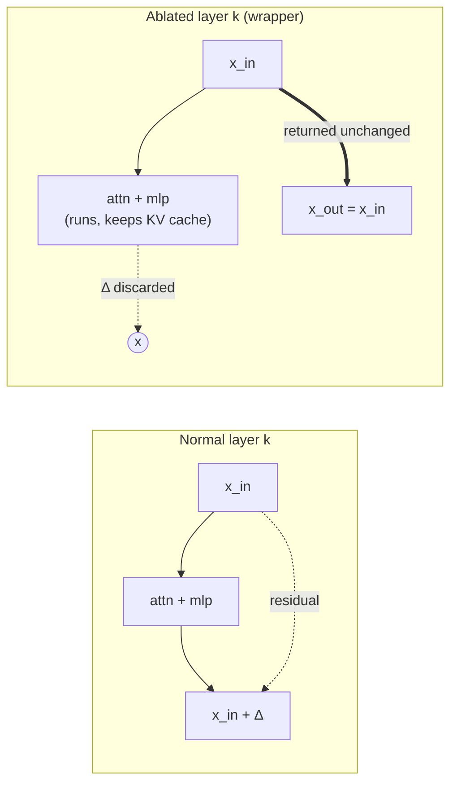
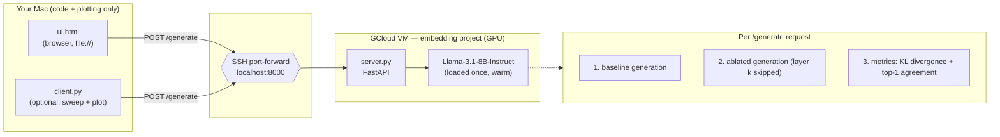

# Layer-Ablation Inference for Llama-3.1-8B-Instruct

**Date:** 2026-07-15
**Status:** Approved

## Goal

Llama-3.1-8B has 32 residual decoder layers. Layer-wise t-SNE of hidden states
shows three regimes:

- **Early (plots L0–L5):** clean category clusters → surface / token-level features.
- **Middle (plots L6–L17):** clusters blur and mix → **concept / meaning-forming** layers.
- **Late (plots L18–L32):** clusters re-separate → task / output-oriented representations.

We want to **remove one meaning-forming middle layer** and observe the effect on
generation, both qualitatively (read the text) and quantitatively (how much the
next-token distribution moved). An interactive UI lets us feed our own prompts.

## What "removing a layer" means

Every decoder layer is residual: `x_out = x_in + attn(x_in) + mlp(x_in)`.
Removing layer *k* means its whole block contributes nothing, so the residual
stream passes straight through: `x_out = x_in`.

### Mechanism (A) — discard-delta wrapper

Wrap the target `LlamaDecoderLayer`. It **still runs** (so the KV cache stays
consistent during `generate()`), but the wrapper returns the layer's **input**
hidden states as its output. Net effect on the residual stream = identity = layer
removed. Installed/removed per request, fully reversible.



## Layer indexing (off-by-one guard)

The t-SNE grid is `output_hidden_states` (33 tensors):
`L0 = embedding output`, and **plot `Lk` = output of decoder layer index `k-1`**.
So ablating the block that produced representation **L15** means ablating
`model.model.layers[14]`.

The API/UI use the **0-based decoder index (0–31)**; the server echoes the plot
label (`decoder[14] → plot L15`). **Default: decoder index 14 (plot L15).**

## System architecture

Heavy model runs on the GPU VM (env already provisioned there). The Mac only
runs a browser UI and an optional plotting client, reaching the VM through an
SSH port-forward.



### Request flow

For each prompt the server runs generation **twice** and compares:

1. **Baseline** — no ablation → `text_base`.
2. **Ablated** — wrap `layers[k]`, generate, unwrap → `text_ablated`.
3. **Metrics** — teacher-forced on the baseline continuation (same context for a
   fair comparison): two forward passes over `prompt + baseline_continuation`,
   one clean and one ablated, giving:
   - **mean KL(ablated ‖ baseline)** of the next-token distribution, and
   - **top-1 agreement %** (fraction of positions where the argmax token matches).

Returns `{ baseline, ablated, layer, plot_label, metrics, timing }`.

## Components

### `server.py` (VM)
- FastAPI + uvicorn, permissive CORS, binds `127.0.0.1:8000` (tunnel-only, not public).
- Loads `meta-llama/Llama-3.1-8B-Instruct` once (bf16 on CUDA; `--load-4bit` fallback),
  HF token from `.env`.
- `AblatedDecoderLayer` wrapper + `ablate(model, k)` context manager.
- `POST /generate` (see request flow); `GET /health`; `GET /info`.
- `--self-test` verifies the wrapper + swap/restore logic without loading the model.

### `ui.html` (Mac)
- Single vanilla-JS file, no build. Open directly in the browser.
- Controls: API base URL (default `http://localhost:8000`), optional system prompt,
  prompt box, **layer dropdown 0–31 (default 14 → L15)**, max new tokens, temperature.
- Output: two panels **Baseline │ Ablated L{k}** side-by-side + a metrics strip
  (KL divergence, top-1 agreement, timing). Single-turn per prompt.

### `client.py` (Mac, optional)
- Thin CLI over the API. Single query by default (prints both responses + metrics).
- `--sweep` iterates a range of layers for one prompt and **plots** KL divergence &
  top-1 agreement vs layer index → `results/sweep.png`. Fits the Mac's plotting role.

## Environment

- **VM:** env already exists (used to produce the t-SNE plots). `requirements-vm.txt`
  is a reference of what must be present (torch, transformers, accelerate, fastapi,
  uvicorn, python-dotenv). No install step owned by this project.
- **Mac:** managed with **`uv`** via `pyproject.toml` (deps: `requests`, `matplotlib`).
  Only needed for `client.py`; `ui.html` needs nothing.

## Connect

```bash
gcloud compute ssh <vm-name> --project <embedding-project> -- -N -L 8000:localhost:8000
```
Then open `ui.html` on the Mac.

## Defaults

- Greedy decoding (temperature 0) so baseline↔ablated differences come from the
  ablation, not sampling noise.
- 256 max new tokens; layer 14 (plot L15).

## Files

```
server.py            # VM: inference + ablation + metrics API
ui.html              # Mac: interactive side-by-side UI
client.py            # Mac: optional CLI + layer-sweep plot
pyproject.toml       # Mac: uv-managed env
requirements-vm.txt  # VM: reference deps (already installed there)
README.md            # setup + tunnel + architecture diagram
.gitignore           # .env, Conversation.md, __pycache__, results/
docs/superpowers/specs/2026-07-15-layer-ablation-inference-design.md
```

## Out of scope (YAGNI)

- Multi-turn chat (single-turn keeps ablation effects clean).
- Multi-layer simultaneous ablation, streaming tokens, auth (tunnel-only).
